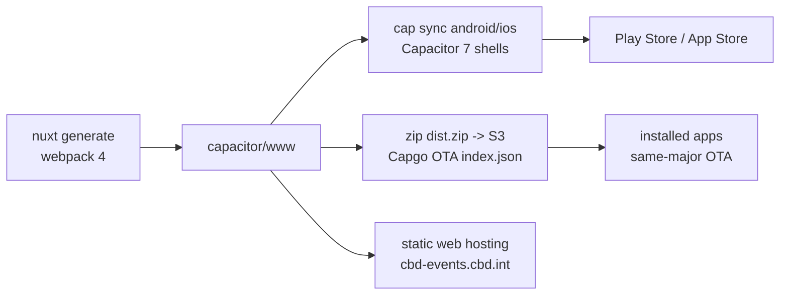
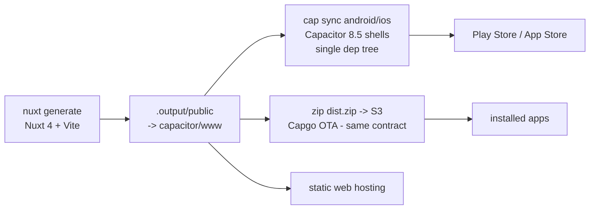

# cbd-events: Nuxt 2 to Nuxt 4 Upgrade - Architectural Plan

| | |
|---|---|
| Ticket | DEV-1106 |
| Status | Draft for review |
| Date | 2026-08-12 |
| Scope | `cbd-events` app (this repo) plus one cross-repo dependency (`@scbd/conference-cal`) |
| Current stack | Nuxt 2.18.1, Vue 2.7.16, Vuex, webpack 4, `@nuxtjs/axios` (unused), nuxt-i18n 6, Bootstrap 4.6 (CSS only), Capacitor 6 (JS) / 7 (native shells), Capgo OTA |
| Target stack | Nuxt 4.5.x, Vue 3.5.x, Vite, Pinia, `$fetch`/ofetch, `@nuxtjs/i18n` 10.x, Bootstrap 4.6 CSS (unchanged), Capacitor 8.5.x (single dependency tree), Capgo OTA (matching major) |

## 1. Why now

- Nuxt 2 has been end-of-life since June 2024. Nuxt 3 reached end-of-life on 2026-07-31, so Nuxt 4 (currently 4.5.1) is the only supported target. There is no value in a two-hop migration through an EOL framework.
- Vue 2 has been EOL since December 2023. Every Vue 2 dependency in this app (vue-cordova, nuxt-i18n 6, the vendored calendar, `@scbd/conference-cal`) is frozen with it.
- The native shells already run Capacitor 7 while the JS layer pins Capacitor 6. The two dependency trees for the same plugins are drift waiting to become a production bug.
- Sass, Node, and toolchain deprecations are already being suppressed in `nuxt.config.js` (`silenceDeprecations`); the workarounds accumulate faster than they can be removed on a dead framework.

## 2. Current state (survey summary)

Full survey was done against `master` at `cba0cf8` (2026-08-12).

| Dimension | Finding |
|---|---|
| Size | 42 SFCs + 34 JS modules, ~5,900 LOC app code. The vendored calendar widget (`components/Calendar/src/**`) is ~2,100 LOC, 36% of the app |
| Rendering mode | `ssr: false` SPA, shipped via `nuxt generate` into `capacitor/www` for the native shells and for web hosting at cbd-events.cbd.int |
| Component style | 100% Options API. Zero `setup()`, zero composition imports. House ESLint style (hoisted function declarations, aligned colons) shapes every file |
| State | Vuex, 6 modules. `conferences.js` (325 LOC) is the app's spine. Actions rely on injected `this.$axios`, `this.$localForage`, `this.$router` (31 sites) |
| Persistence | localforage wrapped by a custom Nuxt 2 module + lodash-templated plugin that builds 5 `new Vue()` instances as service objects (`$localForage.files/blobs/about/article`). This is the offline-first layer |
| Eventing | Two event buses: `this.$root.$on/$emit` (21 sites, 12 files, drives all bottom-sheet flows) and a `new Vue()` bus inside the calendar (8 sites) |
| HTTP | `composables/http.js` switches between raw axios (web) and `@ionic-native/http` (native). `@nuxtjs/axios` is declared but never registered: dead |
| i18n | nuxt-i18n 6, lazy, `en` only registered (a `fr.json` ships in the calendar), Vuex-module coupling (`store.state.i18n.locale`, `I18N_SET_LOCALE`) |
| Mobile | Capacitor 6 (JS) / 7.4.3 (`capacitor/` shells). Plugins actually used in code: core, status-bar, share, filesystem. Declared but unused: app, device, splash-screen, local-notifications, awesome-cordova/ionic-native cores. Legacy Cordova: vue-cordova, `@ionic-native/http`, cordova-plugin-advanced-http, cordova-plugin-file, cordova-plugin-file-opener2 (git-pinned) |
| OTA | `@capgo/capacitor-updater` (autoUpdate off) pulling a hand-maintained S3 `index.json` and `dist.zip` per version from attachments.cbd.int; same-major semver gate; zip layout = `capacitor/www` root |
| Auth | None. All API calls are anonymous GETs against api.cbd.int (v2013 Solr, v2016 conferences/meetings, v2017 articles, v2020 oembed) plus a cross-origin iframe + postMessage bridge into www.cbd.int for document download |
| Config | Build-time `env:` block only, webpack-inlined. No runtime config, no `.env` |
| Safety net | No tests, no CI, no lint script, no pinned Node version. Release is a manual zip-and-upload runbook in README.md |

### Current build and ship pipeline

## 3. Target architecture

- **Nuxt 4.5.x, `ssr: false`, `nuxt generate`.** The rendering model does not change. Nitro's `output.publicDir` (or a copy step) keeps `capacitor/www` as the shell's `webDir` so the OTA zip layout and the native shell config are untouched.
- **`app/` directory structure** per Nuxt 4 conventions: `app/pages`, `app/layouts`, `app/components`, `app/composables`, `app/plugins`, `app/middleware`, `app/assets`; `public/` for the favicon (fixes the currently dangling link); `i18n/locales/` for locale files.
- **Pinia replaces Vuex.** One store per current module. Actions take their dependencies explicitly (composables), ending the `this.$axios` / `this.$localForage` / `this.$router.currentRoute` pattern.
- **`$fetch`/ofetch replaces axios everywhere.** On native platforms, Capacitor's built-in `CapacitorHttp` (`plugins.CapacitorHttp.enabled`) patches `fetch`, which retires `@ionic-native/http`, `cordova-plugin-advanced-http`, and the platform switch in `composables/http.js` in one move.
- **`runtimeConfig.public` replaces the `env:` block.** Note the OTA model means values still bake into each shipped zip; this is about API hygiene, not dynamic reconfiguration.
- **`@nuxtjs/i18n` 10.x** with the same `prefix_except_default` strategy, lazy `en`, cookie detection. The Vuex coupling (`state.i18n.*`, `I18N_SET_LOCALE`) is replaced by the module's composables (`useI18n`, `useSwitchLocalePath`).
- **Composition API with `<script setup>`** for all ported components (house convention for Nuxt 4 work). TypeScript is adopted for new composables/stores; wholesale TS conversion of ported templates is not required in this migration (see open questions).
- **Capacitor 8.5.x, one dependency tree.** Root `package.json` owns all `@capacitor/*` versions; the `capacitor/package.json` split is dissolved or reduced to CLI-only. Unused plugin dependencies (app, device, splash-screen, local-notifications, ionic-native/awesome-cordova cores) are dropped.
- **Bootstrap 4.6 CSS stays.** It is CSS-only today (no bootstrap-vue, no JS). Moving to Bootstrap 5 is real work (form-group and friends are used across 19 SFCs) with zero migration payoff; it is explicitly out of scope.
- **Event buses are removed.** Bottom-sheet done/cancel flows become explicit emits + a small shared composable (`useBottomScreen`); the calendar bus becomes provide/inject or component-local state. `mitt` is the fallback if a true broadcast case remains.
- **The localForage layer becomes a plain composable** (`useOfflineStore` or similar) preserving the current metadata/blob split and the documented `iterate` behavior. The lodash-template plugin and its 5 `new Vue()` service bags are deleted.

## 4. Migration strategy

**Decision: single-repo, in-place port to a fresh Nuxt 4 scaffold, phased into reviewable PRs on a long-lived integration branch. No Nuxt Bridge.**

Options considered:

| Option | Assessment |
|---|---|
| A. Nuxt Bridge, then 3, then 4 | Rejected. Bridge targets Nuxt 3, which is EOL; two framework hops for a 5,900 LOC app is more total work and more intermediate broken states |
| B. In-place port to Nuxt 4 scaffold, phased PRs, integration branch (chosen) | The app is small enough to port module-by-module in weeks, keeps one repo/history, and each phase is independently reviewable. The integration branch (`feat/DEV-XXXX-nuxt4`) holds phases until cutover so `master` stays releasable on Nuxt 2 |
| C. Greenfield rewrite in a new repo | Rejected. Loses history, invites scope creep, and the survey shows the app's logic (conference/meeting state machine, offline layer, OTA) is worth porting, not re-inventing |

Two Vue-2-compatible refactors are deliberately pulled **before** the framework switch (phase 2), because Vue 2.7 supports the Composition API and both changes shrink the hard part of the port:

1. Event-bus elimination (buses are removed APIs in Vue 3, and the flows have no test coverage).
2. Filters to plain functions (filters are removed in Vue 3, and two templates use `this.` inside expressions, which does not even compile under Vue 3).

## 5. Key decisions (ADR-lite)

| # | Decision | Rationale | Alternative rejected |
|---|---|---|---|
| D1 | Target Nuxt 4.5.x directly | Only supported major; Nuxt 3 EOL 2026-07-31 | Bridge/Nuxt 3 hop |
| D2 | Keep `ssr: false` + `nuxt generate` | App is an offline-first mobile shell; SSR adds nothing and risks the OTA contract | SSR/hybrid rendering |
| D3 | Vuex to Pinia, 1:1 module mapping first | Mechanical, reviewable; restructuring state shape is deferred | Redesigning state during the port |
| D4 | axios (and `@ionic-native/http`) to `$fetch` + CapacitorHttp | One HTTP path for web and native; deletes 3 legacy deps and the platform switch | Keeping axios (Vue 3 compatible but redundant with ofetch) |
| D5 | Fork the vendored calendar in place, port it, keep it vendored | It is already vendored source (36% of app LOC); porting in place avoids a package release cycle mid-migration | Extracting it to a package first |
| D6 | `@scbd/conference-cal`: port and republish as 2.x (Vue 3), or vendor its single SFC into this repo | Package is Vue 2 locked (deps on vue 2.6.10, imports raw SFC from node_modules). Decision between republish vs vendor belongs to the team (cross-repo ownership) | Leaving it: blocks `overview.vue` |
| D7 | Keep Bootstrap 4.6 CSS unchanged | CSS-only usage; BS5 migration is orthogonal work | Bundling a BS5 upgrade into this migration |
| D8 | Keep the Capgo OTA contract byte-compatible (zip of the generated www root, S3 index.json, same-major gate) | Every installed client depends on it; breaking it silently bricks updates | Redesigning OTA delivery in the same effort |
| D9 | App version stays same-major (5.x) through the migration release | The Capgo same-major gate means a major bump cuts every installed client off OTA; a 5.x Nuxt 4 release keeps the OTA path alive. Bump majors only deliberately, store-release-first, after the Nuxt 4 build has proven stable | Bumping to 6.0.0 with the framework |
| D10 | Establish minimal CI + smoke tests before the port begins | Zero safety net today; hand-testing two simulators per phase does not scale across 8 phases | Porting first, testing later |
| D11 | Capacitor 8.5.x during the port, not 9 | 8.5 is current stable; 9 is alpha. The Cordova-optional direction of 9 is exactly where this plan lands (all Cordova plugins retired), making a later 9 bump trivial | Waiting on / alpha-adopting 9 |

## 6. Phased roadmap

Each phase is one PR (or a small chain) against the integration branch, sized to the repo's ~200 to 400 LOC review budget where the work is code (docs and lockfile churn excluded). Phases 0 to 2 land on `master` directly since they are Nuxt-2-safe and independently valuable.

| Phase | Deliverable | Contents | Risk |
|---|---|---|---|
| 0 | Dead-code and dependency cleanup (on master) | Remove `@nuxtjs/axios` + orphaned `plugins/axios.js`, `vue-notifications`, `modules/CoverImageMixin.js`, `modules/appEnvironmentsManager.js`, `Calendar/src/directives/Scroll.js`, duplicate page `_meetingCode/WeekSelect.vue`, dead `asyncData` in `components/article.vue`, `CalFooter.vue` + `velocity-animate` (after confirming unreferenced). Fix `NODE_ENV=android|ios` builds running `dev: true`. Fix sweetalert `type:` to `icon:` | Low |
| 1 | Safety net (on master) | `.nvmrc` + `engines`; `lint` script; GitHub Actions workflow (lint + web build); Playwright smoke suite against the generated site: home redirect, conference list, meeting agenda, calendar render, documents iframe boot, downloads page, language page. These are the regression oracle for every later phase | Low |
| 2 | Vue-3-ready refactors on Vue 2.7 (on master) | Replace both event buses (explicit emits + `useBottomScreen` composable; calendar via provide/inject); filters to imported functions (fixes the two `this.`-in-template expressions); remove the `$children[0].$refs` reach-in in `CalBody.vue`; replace `Vue.set`/`$set`, `$forceUpdate` in languages.vue; convert `<template functional>` (Icon, Spinner) to normal SFCs | Medium: touches untested UI flows, protected by phase 1 smoke tests |
| 3 | Nuxt 4 scaffold (integration branch starts) | Fresh `nuxt.config.ts` (`ssr:false`, runtimeConfig, i18n 10, Pinia module, css list), `app/` skeleton, `public/favicon.ico`, ESLint flat config with `eslint-plugin-vue` Vue 3 ruleset, generate output wired to `capacitor/www`. App boots to an empty shell; CI builds it | Low |
| 4 | State + persistence port | Pinia stores 1:1 from Vuex modules; localForage rewrite as composable behind the same call surface; route/params dependencies injected explicitly (`useRoute`); i18n state reads moved to `useI18n`. The reactivity hacks (`slice(0)` clones, keyed-object assignment) are removed with behavior verified by smoke tests | High: this is the spine. Review `store/conferences.js` port line-by-line |
| 5 | Pages, layouts, app components port | 15 pages + 2 layouts + 8 app components to `<script setup>`; `asyncData` to `useAsyncData` (or plain `await` in setup under SPA); `redirects` middleware to `defineNuxtRouteMiddleware`; `nuxt-link tag="li"` to `custom` + slot; transition class renames (`-enter` to `-enter-from`) across app.css and SFC styles; `documentDownloadMixin` to a composable (`useDocumentDownload`) preserving the postMessage protocol; `$nuxt.$loading` to `useLoadingIndicator`; `process.client` to `import.meta.client`; Node builtin imports (`path`, `querystring`) replaced with URL/String helpers | High volume, mostly mechanical. Split into 2 to 3 PRs (pages, layouts+nav, download flow) |
| 6 | Calendar subtree port | The vendored `components/Calendar/src/**` (15 SFCs): directive hook renames (LineClamp), `<transition>` fixes, `$style` modules under Vite, bus removal fallout, raw axios calls to `$fetch`, locale merge via i18n 10 API. Plus D6: `@scbd/conference-cal` port (republish or vendor) for `overview.vue` | High: most fragile UI (week-slide animation), do last among UI work |
| 7 | Capacitor unification + native modernization | Single Capacitor 8.5 dependency tree at root; remove vue-cordova, `@ionic-native/*`, `@awesome-cordova-plugins/*`, cordova-plugin-advanced-http; enable CapacitorHttp; port `CordovaFiles.js`/`localFileSystem.js` to `@capacitor/filesystem`; re-evaluate git-pinned file-opener2 against a Capacitor 8 file-opener plugin; verify status-bar behavior under Capacitor 8's edge-to-edge SystemBars (the DEV-1028 work is in this area; coordinate) | Medium-high: native QA on both platforms |
| 8 | OTA + release pipeline re-validation | Confirm generated output zips to the same layout; verify Capgo updater (major matching Capacitor) applies a Nuxt 4 `dist.zip` over a Nuxt 2 install on 5.x (the critical upgrade path); document the new build in README; update `build:a`/`build:i` scripts; confirm no dotfiles enter the zip (existing hard-brick hazard) | High consequence, low volume. Test on real devices with a staged S3 index |
| 9 | Cutover | Integration branch to master; store builds submitted; OTA published after store versions are live; post-cutover watch | Gate: full device QA matrix + all smoke tests green |

Known upstream integration issues to design around in phases 3 and 7: Capacitor config at repo root as JSON can trip Nuxt 4's module resolution (use `capacitor.config.ts` or keep the config inside `capacitor/`), and app-boot issues reported with Nuxt 4 + Capacitor ([nuxt#32873](https://github.com/nuxt/nuxt/issues/32873), [nuxt#33381](https://github.com/nuxt/nuxt/issues/33381)); validate asset URL resolution under the `capacitor://` scheme in the phase 3 spike before any UI porting begins.

## 7. Risk register

| Risk | Impact | Mitigation |
|---|---|---|
| OTA contract breaks: installed apps stop updating or brick | Critical | D8/D9; phase 8 staged-index device test of Nuxt2-to-Nuxt4 OTA before publishing; keep 5.x major |
| localForage rewrite loses offline data or changes iterate semantics | High | Same storage keys and store names; write a data-compat check on first boot; the quirk is documented in `.github/copilot-instructions.md` |
| Event-bus removal breaks bottom-sheet/settings flows | High | Done in phase 2 on Vue 2.7 where behavior can be A/B checked against master; smoke tests cover the flows |
| `store/conferences.js` port introduces subtle selection-state bugs | High | 1:1 Pinia mapping (D3), line-by-line review, smoke tests exercise conference/meeting selection |
| Calendar animation/`$style`/directive fixes regress the calendar | Medium | Phase 6 isolated; visual check on simulators; consider snapshotting key calendar states in Playwright |
| `@scbd/conference-cal` port stalls on cross-repo ownership | Medium | D6 decision requested at plan review; vendor fallback keeps this repo unblocked |
| Vite vs webpack assumptions (Node builtins, `require()`, lodash template) | Medium | Inventoried in survey; addressed per-file in phases 4 to 6 |
| Capacitor 8 native changes (edge-to-edge, UIScene on iOS) conflict with DEV-1028 styling work | Medium | Coordinate phase 7 with the DEV-1028 branch owner; re-test safe-area handling |
| No tests today; regressions ship unnoticed | High | Phase 1 is mandatory and blocks later phases |
| Store review delays (Play/App Store) at cutover | Low | Submit store builds ahead of OTA publish (phase 9 ordering) |

## 8. Verification strategy

- **Per phase:** lint + web build + Playwright smoke suite in CI (from phase 1 onward). Phases touching native code add manual simulator checks (iOS + Android) for: boot, status bar, offline mode, document download/open, share, OTA apply.
- **Phase 8 gate:** on-device OTA test from a production 5.x Nuxt 2 install to the Nuxt 4 bundle via a staged S3 index, both platforms.
- **Cutover gate:** all smoke tests green, device QA matrix signed off, README release runbook updated and walked through once end-to-end.

## 9. Out of scope

- Bootstrap 5 upgrade (D7).
- Adding authentication, push notifications, or deep links (none exist today; the unused plugin deps are removed, not implemented).
- Redesigning the OTA delivery mechanism (D8) or the manual release runbook beyond updating it for the new build output.
- Full TypeScript conversion of ported view components (new composables/stores are TS; templates port as-is).
- Capacitor 9 (D11).
- French localization completion (the half-built i18n surface ports as-is; enabling `fr` is product work).

## 10. Open questions for plan review

1. **D6:** port and republish `@scbd/conference-cal` for Vue 3, or vendor its SFC into this repo? Recommendation: vendor (fastest, one consumer known); republish only if other apps consume it.
2. Does the team want the phase 0 to 2 PRs released to production (web + OTA) before the port begins, or held? Recommendation: release them; they are independently valuable and de-risk the diff.
3. Who owns the device QA matrix for phases 7 to 9 (which physical devices / OS versions)?
4. Integration branch naming and the Jira epic to parent phases 0 to 9 (each phase should be its own DEV ticket).

## Appendix A: dependency disposition

| Dependency (root package.json) | Disposition |
|---|---|
| nuxt 2.18.1, vue 2.7.16, vue-template-compiler, vue-server-renderer | Replaced by nuxt 4.5.x (vue 3.5 bundled) |
| @nuxtjs/axios | Delete (phase 0; already unregistered/dead) |
| nuxt-i18n 6.28.1 | Replace with @nuxtjs/i18n 10.x (phase 3) |
| vue-cordova, @ionic-native/core, @ionic-native/http, @awesome-cordova-plugins/* | Delete (phase 7; CapacitorHttp + @capacitor/filesystem replace them) |
| vue-notifications | Delete (phase 0; never imported) |
| velocity-animate | Delete (phase 0, pending dead-code confirmation of CalFooter.vue) |
| @capacitor/* 6.x (root) + 7.x (capacitor/) | Unify at 8.5.x in root (phase 7) |
| @capgo/capacitor-updater | Upgrade to the major matching Capacitor 8 (phase 7/8) |
| bootstrap 4.6.2, sweetalert2, localforage, luxon, lodash.debounce, semver, camelcase-keys, object-sizeof | Keep (camelcase-keys no longer needs transpile under Vite) |
| @scbd/ckeditor5-build-inline-full | Keep (CSS-only usage) |
| @scbd/conference-cal 1.0.3 | D6: Vue 3 republish or vendor (phase 6) |
| eslint 7 + babel-eslint + eslint-plugin-vue 7 | Replace with flat-config ESLint 9 + eslint-plugin-vue Vue 3 ruleset (phase 3); recreate the house style rules |
| replace (devDep) | Delete (phase 0; unused) |
