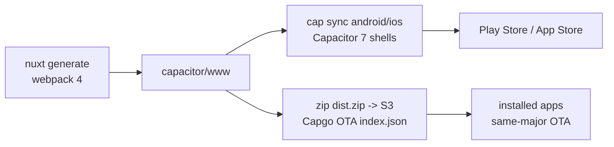
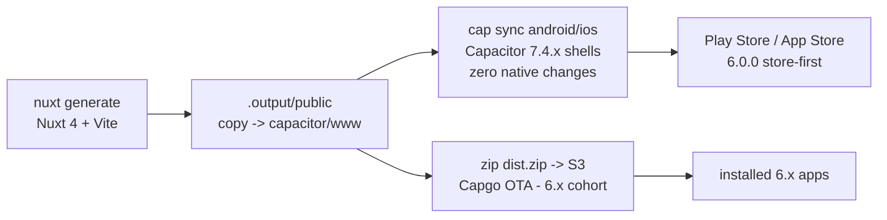

# cbd-events: Nuxt 2 to Nuxt 4 Upgrade - Architectural Plan

| | |
|---|---|
| Ticket | DEV-1106 |
| Status | Draft for review (rev 3 — Bootstrap 5 adopted, web target dropped) |
| Date | 2026-08-12 |
| Scope | `cbd-events` app (this repo) plus one cross-repo dependency (`@scbd/conference-cal`) |
| Current stack | Nuxt 2.18.1, Vue 2.7.16, Vuex, webpack 4, `@nuxtjs/axios` (unused), nuxt-i18n 6, Bootstrap 4.6 (CSS only), Capacitor 6 (JS) / 7.4.3 (native shells), Capgo OTA |
| Target stack | Nuxt 4.5.x, Vue 3.5.x, Vite, Pinia, `$fetch`/ofetch behind a transport interface, `@nuxtjs/i18n` 10.x, Bootstrap 5.3 (CSS only), Capacitor 7.4.x JS aligned to the existing shells (Capacitor 8 deferred to its own release), Capgo OTA (same contract) |
| Review provenance | Devil's-advocate review 2026-08-12, critics codex + agy (2 delivered, 2 seats lost and accepted), 20 objections: 18 fixed into this revision, 1 rejected with evidence, 1 accepted. Complementary execution war-game same date (10 moves, 5 forks) converged on the D9 reversal |

## 1. Why now

- Nuxt 2 has been end-of-life since June 2024. Nuxt 3 reached end-of-life on 2026-07-31, so Nuxt 4 (currently 4.5.1) is the only supported target. There is no value in a two-hop migration through an EOL framework.
- Vue 2 has been EOL since December 2023. Every Vue 2 dependency in this app (vue-cordova, nuxt-i18n 6, the vendored calendar, `@scbd/conference-cal`) is frozen with it.
- The native shells already run Capacitor 7.4.3 while the JS layer pins Capacitor 6. The two dependency trees for the same plugins are drift waiting to become a production bug.
- Sass, Node, and toolchain deprecations are already being suppressed in `nuxt.config.js` (`silenceDeprecations`); the workarounds accumulate faster than they can be removed on a dead framework.

Version claims in this doc were verified 2026-08-12; re-resolve and pin exact versions at each phase's implementation time (repo convention: no `^`/`~`).

## 2. Current state (survey summary)

Full survey was done against `master` at `cba0cf8` (2026-08-12).

| Dimension | Finding |
|---|---|
| Size | 42 SFCs + 34 JS modules, ~5,900 LOC app code. The vendored calendar widget (`components/Calendar/src/**`) is ~2,100 LOC, 36% of the app |
| Rendering mode | `ssr: false` SPA, shipped via `nuxt generate` into `capacitor/www` for the native shells. Native-only: there is no web deployment of this app and none is planned |
| Component style | 100% Options API. Zero `setup()`, zero composition imports. House ESLint style (hoisted function declarations, aligned colons) shapes every file |
| State | Vuex, 6 modules. `conferences.js` (325 LOC) is the app's spine. Actions rely on injected `this.$axios`, `this.$localForage`, `this.$router` (31 sites) — an implicit dependency-injection system, not just state |
| Persistence | localforage wrapped by a custom Nuxt 2 module + lodash-templated plugin that builds 5 `new Vue()` instances as service objects (`$localForage.files/blobs/about/article`). This is the offline-first layer |
| Eventing | Two event buses: `this.$root.$on/$emit` (21 sites, 12 files, drives all bottom-sheet flows) and a `new Vue()` bus inside the calendar (8 sites) |
| HTTP | `composables/http.js` switches between raw axios (web) and `@ionic-native/http` (native), normalizing both to `res.data`. `@nuxtjs/axios` is declared but never registered: dead |
| i18n | nuxt-i18n 6, lazy, `en` only registered (a `fr.json` ships in the calendar), Vuex-module coupling (`store.state.i18n.locale`, `I18N_SET_LOCALE`), `___en` route-name suffixes built by hand in 3 files |
| Mobile | Capacitor 6 (JS) / 7.4.3 (`capacitor/` shells). Capacitor plugins imported in code: core, status-bar, share, filesystem. Platform detection also flows through `$cordova.device` (vue-cordova) on the downloads page. Legacy Cordova: vue-cordova, `@ionic-native/http`, cordova-plugin-advanced-http, cordova-plugin-file, cordova-plugin-file-opener2 (git-pinned for a documented Play-policy reason) |
| OTA | `@capgo/capacitor-updater` (autoUpdate off) pulling a hand-maintained S3 `index.json` and `dist.zip` per version; same-major semver gate on the baked `NUXT_ENV_VERSION`; zip layout = `capacitor/www` root. `notifyAppReady()` is called only inside the update path, never on plain launches — the current lifecycle works in production on updater v6 but is uncharacterized (rollback, interrupted download, corrupt zip, checksum unused) |
| Auth | None. All API calls are anonymous GETs against api.cbd.int (v2013 Solr, v2016 conferences/meetings, v2017 articles, v2020 oembed) plus a cross-origin iframe + postMessage bridge into www.cbd.int for document download |
| Config | Build-time `env:` block only, webpack-inlined. No runtime config, no `.env` |
| Safety net | No tests, no CI, no lint script, no pinned Node version. Release is a manual zip-and-upload runbook in README.md |

### Current build and ship pipeline

## 3. Target architecture

- **Nuxt 4.5.x, `ssr: false`, `nuxt generate`.** The rendering model does not change. Generate to the stock `.output/public` and copy into `capacitor/www` in the build scripts, so the OTA zip layout and the native shell config are untouched.
- **`app/` directory structure** per Nuxt 4 conventions; `public/` for the favicon (fixes the currently dangling link); `i18n/locales/` for locale files.
- **Pinia replaces Vuex, behind explicit service interfaces.** The Vuex modules double as a hidden DI container (`this.$axios`, `this.$localForage`, `this.$router` inside actions). Before porting, define the service interfaces (transport, offline store); actions take dependencies and route params as explicit arguments — never `useRoute()` inside an action body (it throws outside setup context).
- **A framework-neutral transport interface replaces the axios/ionic-native switch.** Characterize the current `useHttp` contract (both paths normalize to `res.data`), port state and pages against the unchanged interface, then swap implementations: ofetch on web, **explicit `CapacitorHttp.request()`** on native. No global fetch patching — the CapacitorHttp native implementation ships inside `@capacitor/core` and is callable on the fielded 7.4.3 shells without any native or config change, which is what keeps OTA compatibility on the table.
- **Capacitor stays on 7.4.x for the entire migration.** The JS tree aligns to the shells that are already in the field; the shells themselves do not change. Retiring the Vue-2-locked JS wrappers (vue-cordova, `@ionic-native/*`, `@awesome-cordova-plugins/*`) needs no native delta. Capacitor 8 (SystemBars edge-to-edge, UIScene, file-opener replacement, cordova plugin removal) is its own post-migration release — phase 10.
- **`runtimeConfig.public` replaces the `env:` block.** The OTA model means values still bake into each shipped zip; this is API hygiene, not dynamic reconfiguration.
- **`@nuxtjs/i18n` 10.x** with the same `prefix_except_default` strategy, lazy `en`, and the same `localePref` cookie. This is a real workstream, not a config swap: `iso` becomes `language`, locale files move to the `i18n/` dir convention, the Vuex coupling is replaced by `useI18n`/`useSwitchLocalePath`, and the hand-built `___en` route names get snapshot tests (3 files construct them manually).
- **Ported components keep the Options API where they compile cleanly under Vue 3.** Rewriting 42 known-working SFCs into `<script setup>` during the port would turn a migration into a greenfield rewrite. `<script setup>` + TypeScript are reserved for new code (stores, composables) and components already under structural surgery (bus/filter/mixin removals). Post-cutover conversion is logged as debt. This is a deliberate migration-scoped exception to the house Nuxt-4 convention.
- **Bootstrap 5.3 replaces Bootstrap 4.6** (CSS-only usage today; no bootstrap JS, no bootstrap-vue, so the upgrade is a class-and-variable migration, not a component-library swap). It lands as its own phase (5b) after the templates are ported, so a BS5 regression is never tangled with a Vue 3 port regression in the same diff.
- **Event buses are removed** (done pre-port, on Vue 2.7 — phase 2). Bottom-sheet done/cancel flows become explicit emits + a small `useBottomScreen` composable; the calendar bus becomes provide/inject.
- **The localForage layer becomes a plain composable** preserving the exact store names, keys, and the documented `iterate` behavior. The lodash-template plugin and its 5 `new Vue()` service bags are deleted.

## 4. Migration strategy

**Decision: single-repo, in-place port to a fresh Nuxt 4 scaffold, phased into reviewable PRs on an integration branch that is never left unbootable. No Nuxt Bridge. Native walking skeleton before any UI port. Capacitor major upgrade decoupled.**

Options considered:

| Option | Assessment |
|---|---|
| A. Nuxt Bridge, then 3, then 4 | Rejected. Bridge targets Nuxt 3 (EOL) and is unmaintained; two framework hops for a 5,900 LOC app is more total work and more intermediate broken states. A bounded Bridge comparison spike was raised in review and rejected: the phase 3 walking skeleton provides the same early-failure discovery without building on a dead branch (accepted risk) |
| B. In-place port to Nuxt 4 scaffold, phased PRs, integration branch (chosen) | Small enough to port module-by-module; one repo/history; each phase independently reviewable. Review hardening: the branch must boot end-to-end from phase 3 onward (walking skeleton), rebase onto master weekly, and phases 4-5 land as vertical slices so state is verified through real UI, not in a vacuum |
| C. Greenfield rewrite in a new repo | Rejected. Loses history, invites scope creep; the app's logic (conference/meeting state machine, offline layer, OTA) is worth porting, not re-inventing |
| D. Two-framework coexistence behind a build flag | Rejected. Two Nuxt majors cannot share one `package.json`; a workspace split is more churn than value at this size |

Two Vue-2-compatible refactors are deliberately pulled **before** the framework switch (phase 2), because Vue 2.7 supports the Composition API and both changes shrink the hard part of the port:

1. Event-bus elimination (buses are removed APIs in Vue 3, and the flows have no test coverage).
2. Filters to plain functions (filters are removed in Vue 3, and two templates use `this.` inside expressions, which does not compile under Vue 3).

## 5. Key decisions (ADR-lite)

| # | Decision | Rationale | Alternative rejected |
|---|---|---|---|
| D1 | Target Nuxt 4.5.x directly | Only supported major; Nuxt 3 EOL 2026-07-31 | Bridge/Nuxt 3 hop; also a bounded Bridge comparison spike (see §4) |
| D2 | Keep `ssr: false` + `nuxt generate`; the app stays native-only | App is an offline-first mobile shell with exactly two delivery channels, the stores and Capgo OTA. SSR adds nothing and risks the OTA contract. A hosted web build was scoped on the Nuxt 2 app and never shipped; it is not being carried into the Nuxt 4 target, so the generated bundle has one consumer — `capacitor/www` | SSR/hybrid rendering; reviving a hosted web build (would be new product work with its own hosting, deploy, deep-link, and SEO decisions — not a migration task) |
| D3 | Vuex to Pinia: state shape 1:1, dependencies explicit | Preserves externally observed state while dismantling the hidden DI (`this.$axios`/`$localForage`/`$router` in actions). One vertical slice (conference load → select → persist → route) migrates end-to-end first to prove the pattern | Blind module-by-module conversion ("mechanical" was an underestimate); redesigning state shape during the port |
| D4 | Transport interface first; ofetch (web) + explicit `CapacitorHttp.request()` (native) behind it | One characterized contract; implementations swap without touching consumers. No global fetch patch — explicit calls work on fielded shells with zero native change | Big-bang axios removal coupled to a native HTTP change (review: changes request/error contracts app-wide in one step) |
| D5 | Fork the vendored calendar in place, port it, keep it vendored | Already vendored source (36% of app LOC); porting in place avoids a package release cycle mid-migration. Its Vue 3/Vite compile risk is pulled early via a phase 3 spike; the full port stays late where regression exposure is lowest | Extracting it to a package first |
| D6 | `@scbd/conference-cal`: resolve BEFORE phase 3 — port and republish as 2.x (Vue 3), or vendor its full dependency closure (SFC + a Vue 3 dragscroll replacement + luxon alignment) into this repo | Package is Vue 2 locked (deps on vue 2.6.10, `vue-dragscroll` 1.x, imports raw SFC from node_modules). "Vendor one SFC" was an unverified simplification — the closure is what gets vendored. Ownership decision belongs to the team but now gates the port start | Deferring the decision into phase 6 (left phase scope undefined) |
| D7 | **(Reversed in review)** Upgrade to Bootstrap 5.3, as its own phase (5b) after the template port | Usage is CSS-only — no bootstrap JS, no bootstrap-vue — so the blast radius is class renames (`ml-*`/`mr-*` → `ms-*`/`me-*`, `*-left`/`*-right` → `*-start`/`*-end`, `badge-*` → `bg-*`, `close` → `btn-close`, `form-group`/`form-row`, `custom-*` form controls, `sr-only` → `visually-hidden`, dropped `.media`/`.jumbotron`) plus the Sass variable/`$theme-colors` surface. Leaving the app on an EOL BS4 while every other layer is modernized just books the same work as debt at higher cost. Phase 5 logs every BS4-only class as it opens each template, and 5b executes against that inventory | The original D7 ("keep BS4.6, audit only") — reversed on review: deferring it preserves an EOL dependency for no migration benefit. Also rejected: folding BS5 into phase 5 (mixes CSS regressions with port regressions in one diff) |
| D8 | Keep the Capgo OTA contract (zip of the generated www root, S3 index.json, same-major gate) — after characterizing it | The delivery mechanism stays; but its lifecycle (notifyAppReady handshake, rollback, interrupted download, corrupt zip, unused checksum) is currently unverified and gets characterized in phase 1 and re-verified against the target updater major in phase 8 | Treating the current OTA code as known-good ("immutable contract" without evidence); redesigning OTA delivery |
| D9 | **(Reversed in review)** Nuxt 4 ships as **6.0.0, store-first**. A final 5.x OTA bundle adds an "update from the store" nudge; the 5.x index entries freeze (never deleted); OTA resumes within 6.x | OTA replaces only the web bundle, never the native shell. A 5.x Nuxt 4 zip would be pulled by every fielded shell — including pre-7.4.3 ones — where the JS↔native bridge contract is not guaranteed: the white-screen scenario D8 exists to prevent. The same-major gate (verified in `composables/over-the-air.js`) makes 6.0.0 a clean, code-free cutoff. Conditional exception: a 5.x OTA of the Nuxt 4 bundle may be considered ONLY if store-console evidence shows the active installed base is on the 7.4.3-era shell AND the walking skeleton proves bundle/shell parity — default remains store-first | The original D9 ("stay 5.x so OTA stays alive") — reversed because it created the exact bricking risk it tried to avoid |
| D10 | Layered safety net before the port; web smoke is NOT the oracle for native risk | Playwright exercises only web code paths (`Capacitor.getPlatform() === 'web'` branches). The net is layered: web smoke + generated-bundle structure checks + localForage migration fixtures + transport contract tests in CI, plus a mandatory device checklist on every native-touching phase | Porting first, testing later; treating a green web suite as migration safety |
| D11 | **(Rewritten in review)** Capacitor stays 7.4.x through the migration; Capacitor 8 is its own post-migration release (phase 10) | Coupling a Capacitor major to the framework migration multiplied risk and broke OTA compatibility for zero Nuxt-4 benefit (Nuxt 4 does not require Capacitor 8). Aligning the JS tree to the fielded 7.4.3 shells removes the 6-vs-7 drift NOW with no native delta | The original D11 (upgrade to 8.5 during the port); waiting on / alpha-adopting Capacitor 9 |
| D12 | Ported components keep Options API; `<script setup>`/TS only for new or already-rewritten code | Vue 3 fully supports Options API; forcing conversion of 42 known-working SFCs inflates the diff and the regression surface. Migration-scoped exception to house convention, logged as post-cutover debt | Wholesale `<script setup>` conversion during the port |

## 6. Phased roadmap

Each phase is one PR (or a small chain) against the integration branch, sized to the repo's ~200 to 400 LOC review budget where the work is code. Phases 0 to 2 land on `master` directly since they are Nuxt-2-safe and independently valuable. **Gate rule: phase 3's walking skeleton must pass before any of phases 4-6 start; D6 must be resolved before phase 3 starts.**

| Phase | Deliverable | Contents | Risk |
|---|---|---|---|
| 0 | Dead-code and dependency cleanup (on master) | Remove `@nuxtjs/axios` + orphaned `plugins/axios.js`, `vue-notifications`, `modules/CoverImageMixin.js`, `modules/appEnvironmentsManager.js`, `Calendar/src/directives/Scroll.js`, duplicate page `_meetingCode/WeekSelect.vue`, dead `asyncData` in `components/article.vue`, `CalFooter.vue` + `velocity-animate` (grep + runtime click-through before each delete; restore in-PR if live). Fix `NODE_ENV=android\|ios` builds running `dev: true`. Fix sweetalert `type:` → `icon:`. Fix the undefined `return test` in `composables/over-the-air.js` | Low |
| 1 | Layered safety net (on master) | `.nvmrc` + `engines` (Nuxt 4 needs Node ^20.19 or >=22.12); `lint` script; GitHub Actions (lint + generate + smoke). Playwright smoke of the 7 core routes with recorded fixtures in CI (live-API runs nightly, non-blocking) — **explicitly caveated as web-only coverage**. Generated-bundle structure check (asset layout, no dotfiles). localForage fixture captured from a real production device (the phase 4 oracle). Transport contract tests around the current `useHttp` behavior. **OTA baseline characterization** on the production build: document observed notifyAppReady/rollback/interrupted-download/corrupt-zip behavior on updater v6 before anything changes | Low volume, high leverage |
| 2 | Vue-3-ready refactors on Vue 2.7 (on master) | One flow per PR: bottom-screen bus → `useBottomScreen` composable; calendar `Bus.js` → provide/inject; filters → imported functions (fixes the two `this.`-in-template expressions); `CalBody.vue` `$children[0].$refs` reach-in → reactive `v-show` state; `<template functional>` (Icon, Spinner) → normal SFCs; `Vue.set`/`$forceUpdate` removals. Manual side-by-side check against a master build per flow | Medium: untested UI flows, protected by phase 1 + per-flow isolation |
| 3 | Nuxt 4 scaffold + **native walking skeleton gate** (integration branch starts) | Fresh `nuxt.config.ts` (`ssr:false`, runtimeConfig, i18n 10 with `language` keys + `i18n/` dir, Pinia module, css list), `app/` skeleton, `public/favicon.ico`, ESLint 9 flat config (Vue 3 ruleset, recreate house style), generate → copy step into `capacitor/www`. **Gate (both platforms, PRODUCTION shells, before any UI port):** skeleton boots under the capacitor scheme with zero webview 404s (known breakage: [nuxt#32873](https://github.com/nuxt/nuxt/issues/32873), [nuxt#33381](https://github.com/nuxt/nuxt/issues/33381) — countermoves: `app.baseURL './'`, else post-generate path rewrite); reads the phase 1 localForage fixture; completes one `CapacitorHttp.request()`; performs one Filesystem op; applies as a staged OTA bundle over the current production install; the vendored calendar subtree compiles under Vite/Vue 3 (compile spike only). Also: i18n route-name (`___en`) snapshot baseline | The gate is the point: fail here, not in phase 6 |
| 4 | State + persistence port (vertical slice first) | Define service interfaces (transport, offline store). Migrate ONE vertical slice end-to-end — conference load → selection → persistence → routed page — proving Pinia + composable + UI wiring together. Then remaining stores 1:1 by state shape. localForage rewrite keeps identical store names/keys + the `iterate` quirk; boot-time data-compat check + the phase 1 real-device fixture as oracle. Route params arrive as action arguments from page setup (never `useRoute()` in actions). i18n state reads → `useI18n`. Reactivity hacks (`slice(0)` clones, keyed-object assignment) removed with behavior verified | High: this is the spine. Getter-parity table for `conferences.js` (14 getters, same fixture in, same output) |
| 5 | Pages, layouts, app components port | 15 pages + 2 layouts + 8 app components, Options API preserved (D12); `asyncData` → setup await/`useAsyncData`; `redirects` middleware → `defineNuxtRouteMiddleware`; `nuxt-link tag="li"` → `custom` + v-slot rendering the SAME `<li>` DOM (nav CSS depends on it); transition class renames (`-enter` → `-enter-from`) across app.css and SFC styles; `documentDownloadMixin` → `useDocumentDownload` with registration guard (duplicate postMessage listeners = double downloads) preserving the www.cbd.int iframe protocol; `$nuxt.$loading` → `useLoadingIndicator`; `process.client` → `import.meta.client`; Node builtin imports (`path`, `querystring`) → URL/String helpers; `$cordova.device` iOS check → `Capacitor.getPlatform() === 'ios'`; `localePath`/`switchLocalePath` parity + route-name snapshots green; **inventory every BS4-only class as each template is opened** (feeds 5b). Split into 2-3 PRs (pages; layouts+nav; download flow) | High volume. i18n/router workstream is real work, not renames |
| 5b | Bootstrap 4.6 → 5.3 (D7) | Swap the dependency to bootstrap 5.3.x; work the phase 5 class inventory: directional utilities (`ml`/`mr`/`pl`/`pr` → `ms`/`me`/`ps`/`pe`, `text-left`/`text-right` → `text-start`/`text-end`, `float-*`), `badge-*` → `bg-*`, `close` → `btn-close`, `form-group`/`form-row`/`custom-*` form markup, `sr-only` → `visually-hidden`, removed `.media` and `.jumbotron`, `data-*` → `data-bs-*` attributes (inert today, no bootstrap JS, but they must not mislead later); reconcile the app's own Sass against the BS5 variable/`$theme-colors` surface; drop any jQuery/Popper assumptions (none present). Visual diff of the 7 core routes plus both bottom-sheet flows, light and dark, against a phase 5 build | Medium: CSS-only and wholly reversible, but touches every template. Isolated from the port on purpose |
| 6 | Calendar subtree + conference-cal port | The vendored `components/Calendar/src/**` (15 SFCs): directive hook renames (LineClamp), `<transition>` fixes (incl. the `v-for` transition → `transition-group`), `$style` modules under Vite, raw axios → transport interface, locale merge via i18n 10 API, week-slide animation rebuilt as reactive state (fallback: reduced fade-only animation rather than holding the migration). Plus D6 execution (already decided pre-phase-3): vendored closure or republished 2.x for `overview.vue` | High: most fragile UI. Compile risk already burned down by the phase 3 spike |
| 7 | Capacitor JS-tree alignment (zero native changes) | Single Capacitor **7.4.x** dependency tree at root matching the shells; remove vue-cordova, `@ionic-native/*`, `@awesome-cordova-plugins/*` JS wrappers; native HTTP via the D4 transport (explicit `CapacitorHttp.request()`); `CordovaFiles.js`/`localFileSystem.js` → `@capacitor/filesystem`; the git-pinned cordova-plugin-file-opener2 and cordova-plugin-file **stay in the shells untouched** (their JS call sites keep working; replacement is phase 10). Device verification checklist on both platforms | Medium: JS-only by design; native QA still mandatory |
| 8 | OTA re-validation + release pipeline | Verify the generated output zips to the same layout (no dotfiles — existing hard-brick hazard); verify the updater handshake against the shipped updater version (notifyAppReady timing, rollback, interrupted download, corrupt zip) vs the phase 1 baseline; adopt the checksum param; staged S3 index test on real devices: production 5.x Nuxt 2 install → staged Nuxt 4 zip → boots with offline data intact. Execute D9: final 5.x nudge bundle prepared; 6.0.0 versioning wired; production index.json untouched until phase 9 | High consequence, low volume |
| 9 | Cutover (store-first) | Submit 6.0.0 to Play internal track + TestFlight; full device QA matrix; publish store releases; **only after both store versions are live**: publish the final 5.x nudge bundle and the 6.x OTA entries; post-cutover watch. Never during a major CBD meeting (freeze windows — open question 5) | Gate: staged OTA test green on both platforms + smoke green + QA sign-off |
| 10 | Capacitor 8 upgrade (own release, post-migration) | Capacitor 8.5.x (verified current 2026-08-12) single tree + shells: SystemBars edge-to-edge (coordinate with the DEV-1028 safe-area work), iOS UIScene (8.5), updater major aligned to Capacitor 8, file-opener2 replacement **with a manifest-permission audit** (the git pin exists because broad file permissions trigger Play rejection — keep the pin if no compliant equivalent), cordova plugin removal, then a 6.x store release + OTA within the 6.x cohort | Medium-high, but isolated from the framework migration by design |

## 7. Risk register

| Risk | Impact | Mitigation |
|---|---|---|
| OTA delivers a bundle the fielded native shell cannot run (white screen; no rollback for affected users) | Critical | D9 reversed: 6.0.0 store-first; same-major gate blocks old shells mechanically; staged-index device test from a real production install (phase 8); production index frozen until store releases are live (phase 9) |
| Current OTA lifecycle misunderstood (notifyAppReady only called in the update path; rollback semantics unverified; checksum unused) | High | Phase 1 characterization baseline on updater v6; phase 8 re-verification against the shipped updater; adopt checksum |
| localForage rewrite loses offline data or changes iterate semantics | High | Identical store names/keys; real-device fixture captured in phase 1 as the only valid oracle (fresh installs false-pass); boot-time compat check; migration shim if needed |
| `store/conferences.js` port introduces selection-state bugs | High | Vertical-slice-first (D3); getter-parity table; smoke tests exercise conference/meeting selection |
| Walking-skeleton class failures: capacitor-scheme assets, Vite/Vue 3 calendar compile, CapacitorHttp on device | High | All pulled into the phase 3 gate — fail before the port, not after it |
| Integration branch drifts from an active master / stays unbootable | High | Bootable-branch invariant from phase 3; weekly rebase; master feature-freeze sought (open question 4) |
| i18n 6→10 route-name/URL drift breaks deep links and the language switcher | Medium | Route-name snapshot tests from phase 3; `localePref` cookie parity; localePath/switchLocalePath parity checks |
| Duplicate postMessage listeners double-fire document downloads | Medium | Registration guard in `useDocumentDownload`; smoke assertion on single-fire |
| Bootstrap 5 class migration silently breaks layout on a screen nobody opens during QA | Medium | Phase 5 produces the class inventory, so 5b works a list rather than a grep-and-hope; CSS-only change lands in its own PR, separate from the port, and reverts cleanly; visual diff of the 7 core routes plus both bottom-sheet flows on device |
| Calendar animation regresses | Medium | Reactive rebuild verified in browser; explicit fallback to reduced animation rather than schedule slip |
| `@scbd/conference-cal` stalls on cross-repo ownership | Medium | D6 now gates phase 3 start; vendor-the-closure fallback keeps this repo unblocked |
| file-opener replacement triggers Play-policy rejection | Medium | Deferred to phase 10 with a mandatory manifest-permission audit; git pin retained through the migration |
| Store review delays at cutover | Low | Store-first ordering already required by D9; no hard external deadline for cutover |

## 8. Verification strategy

- **Per phase:** lint + generate + web smoke (fixtures) + bundle-structure check in CI. Web smoke is web-only coverage by definition — every phase that touches runtime behavior on device (3, 4, 5b, 6, 7, 8, 9, 10) additionally requires the device checklist on both platforms: boot, status bar, offline mode, document download/open, share, OTA apply. Evaluate Maestro (or scripted `cap run` flows) for automating the native checklist; until then it is a manual, recorded checklist per PR.
- **Phase 3 gate:** all walking-skeleton items observed on both platforms before phases 4-6 begin.
- **Phase 8 gate:** on-device staged-index OTA from a production 5.x Nuxt 2 install to the Nuxt 4 bundle, offline data intact, both platforms.
- **Cutover gate:** store builds live, staged OTA green, device QA matrix signed off, README release runbook updated and walked through once end-to-end.

## 9. Out of scope

- Adding authentication, push notifications, or deep links (none exist today).
- Redesigning the OTA delivery mechanism (D8) beyond characterizing and re-verifying it.
- Wholesale `<script setup>`/TypeScript conversion of ported components (D12 — post-cutover debt).
- Capacitor 8 and 9 during the migration (D11 — Capacitor 8 is phase 10, its own release; 9 is alpha).
- French localization completion (the half-built i18n surface ports as-is; enabling `fr` is product work).

## 10. Open questions for plan review

1. **D6 (gates phase 3):** port and republish `@scbd/conference-cal` for Vue 3, or vendor its full dependency closure into this repo? Recommendation: vendor (fastest, one known consumer); republish only if other apps consume it — needs an org-wide code search to answer.
2. Release the phase 0-2 PRs to production (OTA) before the port begins, or hold them? Recommendation: release; they are independently valuable and de-risk the diff.
3. Who owns the device QA matrix (devices / OS versions) and sign-off for phases 3 and 7-10?
4. Will the team agree to a master feature-freeze (or strict rebase discipline) while phases 3-9 are on the integration branch?
5. Cutover freeze windows: which upcoming CBD meetings (COP/SBSTTA/SBI) must the phase 9 cutover avoid?
6. Integration branch naming and the Jira epic to parent phases 0-10 (each phase should be its own DEV ticket).
7. Store-console adoption stats (V6): what share of active installs run the current 7.4.3-era shells? (Quantifies the D9 conditional path; the default store-first plan does not depend on it.)

## Appendix A: dependency disposition

| Dependency (root package.json) | Disposition |
|---|---|
| nuxt 2.18.1, vue 2.7.16, vue-template-compiler, vue-server-renderer | Replaced by nuxt 4.5.x (vue 3.5 bundled) — phase 3+ |
| @nuxtjs/axios | Delete (phase 0; already unregistered/dead) |
| nuxt-i18n 6.28.1 | Replace with @nuxtjs/i18n 10.x (phase 3; full workstream — `iso`→`language`, dir restructure, route-name snapshots) |
| vue-cordova, @ionic-native/core, @ionic-native/http, @awesome-cordova-plugins/* | Delete JS wrappers (phase 7; transport interface + `Capacitor.getPlatform()` replace them; **no native changes**) |
| cordova-plugin-advanced-http, cordova-plugin-file, cordova-plugin-file-opener2 (git-pinned) — native shells | **Keep through the migration** (phase 7 is JS-only). Removal/replacement in phase 10 with a Play-policy manifest audit |
| vue-notifications | Delete (phase 0; never imported) |
| velocity-animate | Delete (phase 0, after grep + runtime confirmation of CalFooter.vue) |
| @capacitor/* 6.x (root) vs 7.4.3 (capacitor/) | Unify at **7.4.x** in root (phase 7), matching the fielded shells. Capacitor 8.5.x in phase 10 (own release) |
| @capgo/capacitor-updater | Keep the Capacitor-7-compatible major through the migration; verify handshake + adopt checksum (phase 8). Align major to Capacitor 8 in phase 10 |
| @capacitor/device (JS dep) | Delete the unused JS import; the downloads-page iOS check (`$cordova.device`, downloads.vue:68) is replaced by `Capacitor.getPlatform() === 'ios'` in phase 5 |
| bootstrap 4.6.2 | Upgrade to 5.3.x (phase 5b, D7) — CSS-only usage, so it is a class + Sass-variable migration |
| sweetalert2, localforage, luxon, lodash.debounce, semver, camelcase-keys, object-sizeof | Keep (camelcase-keys no longer needs transpile under Vite) |
| @scbd/ckeditor5-build-inline-full | Keep (CSS-only usage) |
| @scbd/conference-cal 1.0.3 | D6: Vue 3 republish or vendored dependency closure — decided before phase 3, executed in phase 6 |
| eslint 7 + babel-eslint + eslint-plugin-vue 7 | Replace with flat-config ESLint 9 + Vue 3 ruleset (phase 3); recreate the house style rules |
| replace (devDep) | Delete (phase 0; unused) |
